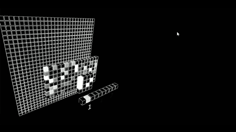

# Handwritten Image Classifier

 This is a Neural Network that analyzes and identifies handwritten digits and alphabets in real time

 

This web app is deployed, [here](https://share.streamlit.io/timmyy3000/handwritten-image-classifier)
## Neural Network

The Neural Network consists of three layers ;

- Convolutional2D Input Layer - Gotten from 28 * 28 individual pixel values. (784 distict values )
- Hidden Layer - 128 neurons
- Output Layer - 10 / 26 nodes

## Training Data

The MNIST database is available at http://yann.lecun.com/exdb/mnist/
The MNIST database is a dataset of handwritten digits. It has 60,000 training samples, and 10,000 test samples. Each image is represented by 28x28 pixels, each containing a value 0 - 255 with its grayscale value.
This Model has been trained to ~98% accuracy in analyzing and recognizing handwritten digits using a 3 layered Neural Network

----

This A_Z Handwritten Dataset is available at https://www.kaggle.com/sachinpatel21/az-handwritten-alphabets-in-csv-format
The dataset contains 26 folders (A-Z) containing handwritten images in size 2828 pixels, each alphabet in the image is centre fitted to 2020 pixel box.
The images are taken from NIST(https://www.nist.gov/srd/nist-special-database-19) and NMIST large dataset and few other sources which were then formatted as mentioned above.
         
This Model has been trained to ~98% accuracy in analyzing and recognizing numerical and alphabetical characters using a Convolutional Neural Network

    

## Tools
The web app was built in Python using the following libraries:
* streamlit
* pandas
* numpy
* scikit-learn
* pickle
* tensorflow
* keras
